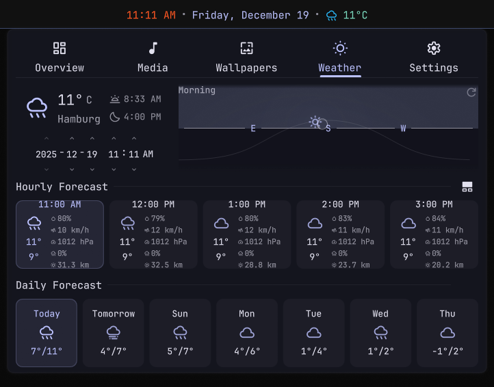
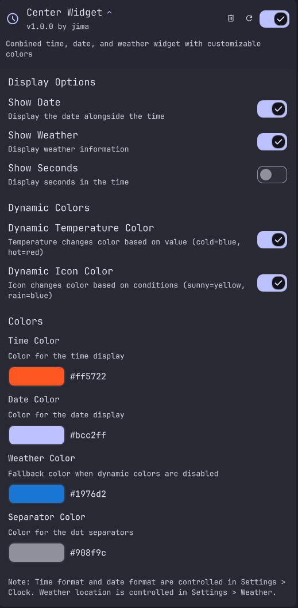

# CenterWidget

A combined time, date, and weather widget for DankMaterialShell with dynamic color support.


## Screenshots





## Features

- **Time & Date Display** - Clean, customizable time and date
- **Weather Integration** - Current temperature and conditions
- **Dynamic Temperature Colors** - Temperature text changes color based on temp:
  - Freezing (≤0°C): Icy blue
  - Cold (≤10°C): Light blue
  - Cool (≤15°C): Cyan/teal
  - Mild (≤20°C): Green
  - Warm (≤25°C): Yellow-green
  - Hot (≤30°C): Yellow/orange
  - Very hot (≤35°C): Orange
  - Extreme (>35°C): Red-orange

- **Dynamic Condition Colors** - Weather icon changes color based on conditions:
  - Clear/Sunny: Yellow
  - Cloudy: Gray-blue
  - Fog: Muted gray
  - Drizzle: Light blue
  - Rain: Blue
  - Snow: White/light gray
  - Thunderstorm: Purple

- **Settings Panel** - Customize colors for time, date, weather, and separators
- **Click Action** - Opens DankDash weather tab

## Installation

Clone to plugins directory or symlink:

```bash
# Option 1: Clone entire repo
cd ~/.config/DankMaterialShell/plugins
git clone https://github.com/jimallen/dms-plugins.git
ln -s dms-plugins/CenterWidget CenterWidget

# Option 2: Symlink if already cloned elsewhere
ln -s /path/to/dms-plugins/CenterWidget ~/.config/DankMaterialShell/plugins/CenterWidget
```

Then enable the plugin in DMS Settings > Plugins.

## Configuration

Access settings through DMS Settings > Plugins > Center Widget:

### Display Options
- **Show Date** - Toggle date display
- **Show Weather** - Toggle weather display
- **Show Seconds** - Toggle seconds in time display

### Dynamic Colors
- **Dynamic Temperature Color** - Temperature changes color based on value
- **Dynamic Icon Color** - Icon changes color based on weather conditions

### Colors
- **Time Color** - Custom color for time (default: #d8bbf2)
- **Date Color** - Custom color for date (default: #bcc2ff)
- **Weather Color** - Fallback color for weather (default: #cac1e9)
- **Separator Color** - Color for dot separators (default: #908f9c)

## Requirements

- DankMaterialShell
- Weather enabled in DMS Settings (for weather display)

## License

MIT
